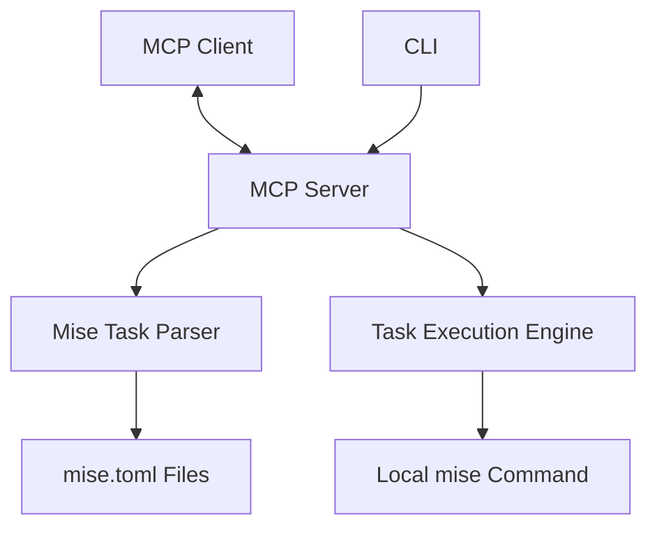

# 設計ドキュメント

## 概要

mise-task-runner-mcpは、miseのタスクランナーとModel Context Protocol（MCP）を統合するサーバーです。このサーバーは、mise.tomlファイルからタスク情報を抽出し、MCPインターフェースを通じてそれらを利用可能なツールとして提供します。ユーザーはMCPクライアントを通じてタスクを選択し、ローカル環境で実行することができます。

このサービスはDenoで実装され、npxを通じて簡単にインストールして使用できるようになります。

## アーキテクチャ

システムは以下の主要コンポーネントで構成されます：

1. **MCPサーバー**: MCPプロトコルに準拠したサーバーで、クライアントからのリクエストを処理します。
2. **Miseタスクパーサー**: mise.tomlファイルを解析し、タスク情報を抽出するコンポーネント。
3. **タスク実行エンジン**: 選択されたタスクをローカル環境で実行するコンポーネント。
4. **CLI**: サーバーの起動、設定、ヘルプ表示などのコマンドラインインターフェース。

### システム構成図



## コンポーネントとインターフェース

### MCPサーバー

MCPサーバーは、MCPプロトコルに準拠したインターフェースを提供し、以下の機能を実装します：

- MCPクライアントとの接続確立
- 利用可能なツール（miseタスク）のリスト提供
- タスク実行リクエストの処理
- 実行結果のクライアントへの返送

**インターフェース**:

```typescript
interface MCPServer {
  start(): Promise<void>;
  stop(): Promise<void>;
  listTools(): Promise<Tool[]>;
  executeTool(toolName: string, params: Record<string, unknown>): Promise<ExecutionResult>;
}

interface Tool {
  name: string;
  description: string;
  parameters?: ToolParameter[];
}

interface ToolParameter {
  name: string;
  description: string;
  required: boolean;
  type: string;
}

interface ExecutionResult {
  success: boolean;
  output: string;
  error?: string;
}
```

### Miseタスクパーサー

Miseタスクパーサーは、mise.tomlファイルを解析してタスク情報を抽出します：

- ワークスペース内のmise.tomlファイルの検索
- TOMLファイルの解析
- タスク名と説明の抽出
- タスク情報のキャッシュと更新

**インターフェース**:

```typescript
interface MiseTaskParser {
  findMiseTomlFiles(directory: string): Promise<string[]>;
  parseMiseToml(filePath: string): Promise<MiseConfig>;
  extractTasks(config: MiseConfig): MiseTask[];
  refreshTasks(): Promise<MiseTask[]>;
  getTasks(): MiseTask[];
}

interface MiseConfig {
  tasks?: Record<string, MiseTaskDefinition>;
  // その他のmise.toml設定
}

interface MiseTaskDefinition {
  cmd?: string;
  description?: string;
  dependencies?: string[];
  // その他のタスク設定
}

interface MiseTask {
  name: string;
  description: string;
  filePath: string;
  definition: MiseTaskDefinition;
}
```

### タスク実行エンジン

タスク実行エンジンは、選択されたタスクをローカル環境で実行します：

- miseコマンドの構築と実行
- 実行出力のキャプチャ
- エラー処理

**インターフェース**:

```typescript
interface TaskExecutionEngine {
  executeTask(taskName: string, params?: Record<string, string>): Promise<ExecutionResult>;
  buildCommand(taskName: string, params?: Record<string, string>): string;
}
```

### CLI

CLIは、サーバーの起動、設定、ヘルプ表示などのコマンドラインインターフェースを提供します：

- サーバーの起動と停止
- ポート設定
- ヘルプとバージョン情報の表示

**インターフェース**:

```typescript
interface CLI {
  parseArgs(args: string[]): CLIOptions;
  run(options: CLIOptions): Promise<void>;
  showHelp(): void;
  showVersion(): void;
}

interface CLIOptions {
  port?: number;
  help?: boolean;
  version?: boolean;
  // その他のオプション
}
```

## データモデル

### MiseTask

```typescript
interface MiseTask {
  name: string;          // タスク名
  description: string;   // タスクの説明
  filePath: string;      // タスクが定義されているファイルのパス
  definition: {
    cmd?: string;        // 実行コマンド
    description?: string; // 説明
    dependencies?: string[]; // 依存タスク
    // その他のタスク設定
  }
}
```

### MCPTool

```typescript
interface MCPTool {
  name: string;          // ツール名（タスク名）
  description: string;   // ツールの説明（タスクの説明）
  parameters?: {         // オプションのパラメータ
    name: string;        // パラメータ名
    description: string; // パラメータの説明
    required: boolean;   // 必須かどうか
    type: string;        // パラメータの型
  }[];
}
```

### ExecutionResult

```typescript
interface ExecutionResult {
  success: boolean;      // 実行が成功したかどうか
  output: string;        // 標準出力
  error?: string;        // エラー出力（存在する場合）
}
```

## エラー処理

エラー処理は以下のシナリオに対応します：

1. **mise.tomlファイルが見つからない**: 適切なエラーメッセージを返し、ユーザーにmise.tomlファイルの作成を促します。
2. **mise.tomlファイルの解析エラー**: 構文エラーの詳細を提供し、修正方法を示唆します。
3. **タスク実行エラー**: miseコマンドの実行中に発生したエラーを詳細に報告します。
4. **MCPプロトコルエラー**: プロトコル違反や通信エラーを適切に処理します。

エラーメッセージは明確で、可能な場合は解決策を提案するものとします。

## テスト戦略

テストは以下のレベルで実施します：

1. **ユニットテスト**: 各コンポーネントの個別機能をテスト
   - Miseタスクパーサーのファイル解析機能
   - タスク実行エンジンのコマンド構築機能
   - CLIの引数解析機能

2. **統合テスト**: コンポーネント間の連携をテスト
   - MCPサーバーとMiseタスクパーサーの連携
   - MCPサーバーとタスク実行エンジンの連携

3. **エンドツーエンドテスト**: システム全体の動作をテスト
   - サンプルのmise.tomlファイルを使用したタスク検出と実行
   - エラーケースのハンドリング

テストはDenoのテストフレームワークを使用して実装し、CI/CDパイプラインに組み込みます。

## 実装計画

実装は以下のフェーズで進めます：

1. **フェーズ1**: 基本的なMCPサーバーとMiseタスクパーサーの実装
2. **フェーズ2**: タスク実行エンジンの実装
3. **フェーズ3**: CLIの実装とnpxでのインストール対応
4. **フェーズ4**: テストとドキュメントの作成

各フェーズでは、テスト駆動開発（TDD）アプローチを採用し、機能の安定性を確保します。

## セキュリティ考慮事項

1. **コマンド実行**: ユーザー入力が直接コマンド実行に使用されないよう、適切なバリデーションとエスケープを実施します。
2. **ファイルアクセス**: 必要最小限のファイルアクセス権限で動作するよう設計します。
3. **ネットワーク**: ローカルネットワークでのみ動作するよう制限し、必要に応じて認証機能を追加します。

## 配布方法

サーバーは以下の方法で配布します：

1. **npmパッケージ**: npxコマンドで直接実行できるようにnpmパッケージとして公開します。
2. **Denoモジュール**: Denoのモジュールとしても公開し、直接importして使用できるようにします。

パッケージには、README、使用方法の例、トラブルシューティングガイドなどのドキュメントを含めます。